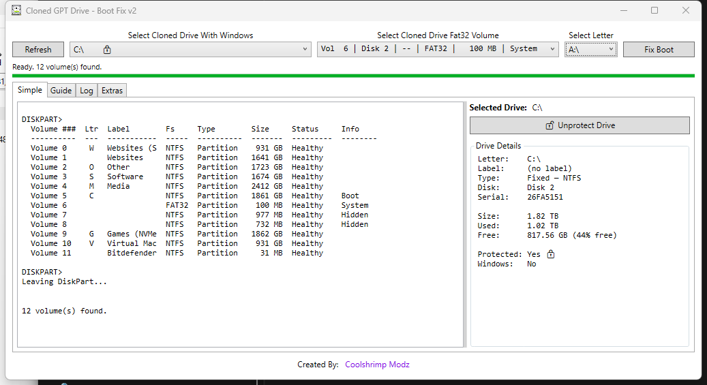
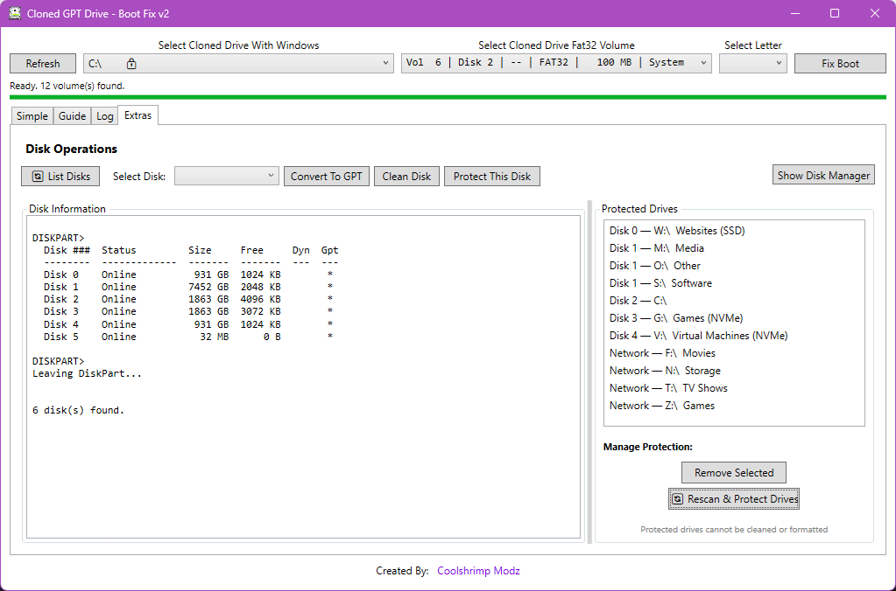

# Cloned GPT Drive - Boot Fix

A Windows utility for repairing the boot configuration on a GPT drive that was cloned from another machine. 
When you clone a GPT/UEFI Windows drive to a new physical disk, the boot files often don't match the new disk's EFI partition — this tool re-links them so the cloned drive boots correctly.

> ⚠️ **This tool performs low-level disk operations (diskpart, bcdboot) and requires Administrator privileges.** 

Read the [Safety Features](#safety-features) section before use.

## Screenshots

Main view — drive selection with Windows ★ / protected 🔒 markers, recommended EFI volume, and live drive details:



Extras tab — disk operations, and the protected drives list showing each drive's physical disk (network drives protected automatically):



## Features

- **Guided Boot Repair** — select your cloned Windows drive and its FAT32 EFI partition, assign a temporary letter, and repair the boot files in one click.
- **Guide Tab** — built-in step-by-step instructions inside the app.
- **List Disks Tab** — list disks, convert a disk to GPT, clean a disk, or open Disk Management.
- **Protected Drives List** — mark drives (like your main OS drive) as protected so they can never be cleaned or wiped through this tool.
- **First-Run Protection Scan** — on first launch, the app detects your system/boot drives and offers to protect them automatically.
- **Double-confirmation on destructive actions** — Clean Disk and Convert to GPT require explicit confirmation and are blocked entirely for protected drives.

## How It Works

1. Connect the cloned drive to your PC.
2. Select the cloned drive (the one with Windows on it) from the dropdown.
3. Click **Refresh** and select the small FAT32 EFI partition on the cloned drive.
4. Pick any unused drive letter to use temporarily.
5. Click **Fix Boot**. The tool will:
   - Assign the temporary letter to the EFI partition
   - Run `bcdboot` to rebuild boot files from the cloned Windows installation
   - Remove the temporary letter again
6. Done — the cloned drive should now boot on its new hardware.

See the in-app **Guide** tab for the full walkthrough with screenshots-in-text.

## Safety Features

Because this tool can run destructive disk commands (`clean`, `convert gpt`), the following protections are built in:

- **Protected Drives list** (persisted per-user) — any drive letter added to this list cannot be targeted by Clean Disk or Convert to GPT.
- **Automatic system drive protection** — on first run, the app scans logical drives, detects your system/boot drive(s), and offers to protect them.
- **Manual protection** — use the Info tab's Protect/Unprotect button (protects the whole disk) or the List Disks tab to protect all drive letters belonging to a specific disk, or manage the protected list directly (add/remove).
- **Confirmation dialogs** — destructive operations show the target disk info and require an explicit Yes; Clean Disk requires a second "final warning" confirmation.

Even with these safeguards, **always double-check which disk/drive is selected before confirming any destructive operation.** This tool modifies partition tables and boot configuration — misuse can make a drive unbootable or erase data.

## Requirements

- Windows 10/11
- .NET Framework 4.7.2
- Administrator privileges (required for `diskpart` and `bcdboot`)

## Download

Grab `ClonedGPTDrive-BootFix.exe` from the [Releases](../../releases) page — a single portable exe, no install and nothing to extract. It prompts for Administrator on launch. (Windows SmartScreen may warn because the exe is unsigned; choose "More info → Run anyway".)

## Building from Source

Open `Cloned GPT Drive - Boot Fix.sln` in Visual Studio 2019+ and build the `Cloned GPT Drive - Boot Fix` project (Release or Debug), or build from the command line with MSBuild:

```
msbuild "Cloned GPT Drive - Boot Fix.sln" /p:Configuration=Release
```

Releases are built automatically by GitHub Actions: pushing a version tag (e.g. `v2.0.0`) compiles the app and publishes the zipped exe on the Releases page.

## Disclaimer

This software is provided "as is" with no warranty. Disk partitioning and boot repair operations carry inherent risk of data loss. Always back up important data before using disk utilities. See [LICENSE](LICENSE) for full terms.

## License

Licensed under the [MIT License](LICENSE).
